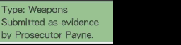

# Gerador de Imagens do Ace Attorney

**Programa desenvolvido para agilizar na edição de imagens do jogo "Ace Attorney Trilogy", para Nintendo 3DS.**

[Prévia ao vivo](https://leomontenegro6.github.io/aaig/)

[Prévia ao vivo - Mirror](http://www.romhacking.net.br/tools/aaig/)

"Ace Attorney Trilogy" é um jogo bastante extenso, com centenas de imagens com textos a ser editadas:

*   Botões brancos com textos em vermelho cor-de-vinho;

*   Nomes de provas / perfis, com fundo cinza escuro e textos em cor laranja;

*   Subtítulos de provas / perfis, com fundo verde claro e textos em cor cinza escuro;

*   Descrições de provas, com fundo cinza escuro e textos em cor branca;

A maneira tradicional de editar esses gráficos é através de arquivos .PSD via Adobe Photoshop, o que acaba sendo um trabalho extremamente repetitivo e cansativo para os romhackers. Foi justamente pensando em otimizar estes processos que eu criei este software.

O "Gerador de Imagens do Ace Attorney" é um programa que consegue gerar as imagens no padrão do jogo "Ace Attorney Trilogy". Para isso, são utilizadas as seguintes tecnologias:

*   Versão Web
    *   HTML5, para a montagem das páginas;
    *   CSS3, para a estilização dos textos nas imagens;
    *   JavaScript e [jQuery](https://jquery.com/), para a programação de campos e botões;
    *   [Html2canvas](http://html2canvas.hertzen.com/), para conversão de elementos HTML para imagens em PNG;
    *   [Bootstrap](http://getbootstrap.com/), para tornar esta página responsiva;
    *   [Bootstrap Slider](https://github.com/seiyria/bootstrap-slider), para os campos de escala;
    *   [Select2](https://select2.org/), para instanciar campos select customizáveis, com suporte a interpretação HTML e busca em ajax;
    *   [stash](http://rezitech.github.io/stash/), para armazenamento de configurações locais do usuário, como tema e idioma;
    *   [JSZip](https://stuk.github.io/jszip/), para criação de arquivos zipados contendo imagens;
    *   [FileSaver.js](https://github.com/eligrey/FileSaver.js/), para salvar arquivos no lado do cliente, necessário para a geração de imagens em lote;
*   Versão Desktop
    *   [Electron.js](https://electronjs.org/), para conversão do conteiner web do programa para um app desktop multiplataforma;
    *   [system-font-families](https://github.com/rBurgett/system-font-families), para ler as fontes instaladas no PC do usuário e montar um campo seletor de fonte.

#### Pré-Requisitos

*   Um navegador moderno atualizado. De preferência o Google Chrome, visto que em outros navegadores, como Mozilla Firefox, Safari ou Internet Explorer, poderão surgir algumas diferenças de comportamento de estilizações CSS;
*   A fonte "Arial" instalada no seu computador. Necessária para a geração correta das imagens de botões por exemplo (Caso use Windows, desconsidere);
*   A fonte "Vaud Book" instalada no seu computador. Necessária para a geração correta das imagens de descrições de provas por exemplo;
*   APENAS WEB: Um servidor web. O programa não funcionará se executado localmente pelo navegador do usuário¹.

¹ Mesmo este programa sendo totalmente local, a forma como as imagens são geradas (conversão de elementos <canvas> para imagem PNG) viola certas [diretrizes de segurança de navegadores web](http://stackoverflow.com/questions/22710627/tainted-canvases-may-not-be-exported) . Por isso, recomenda-se executar este programa a partir de um servidor web (Apache2 por exemplo), nem que seja apenas para servir os arquivos para os clientes.

#### Como usar?

1.  Selecione o tipo de imagem a ser gerada, clicando em uma das abas "Botões", "Nome da Prova / Perfil", etc;
2.  No campo de texto, digite o texto a ser inserido na imagem;
3.  Opcional: Altere a plataforma, escala, fonte e margens de acordo com o texto digitado, se for o caso;
4.  Opcional: Em caso de uso de fontes externas, siga os passos:
    *   No campo "Fonte", escolha a opção "Outra";
    *   Digite o nome da fonte no campo de texto que surgiu ao lado;
    *   Uma vez que o nome tenha sido digitado corretamente, o navegador imediatamente deve fazer uso da mesma e replicar o resultado;
5.  Ao realizar qualquer operação nos itens anteriores a este, a imagem é automaticamente atualizada na seção "Prévia". Verifique se a prévia está de acordo com o seu contexto, e altere os campos anteriores da maneira que lhe for conveniente;
6.  Recomendado: Desfaça qualquer alteração de zoom do seu navegador, pois isto pode prejudicar a geração das imagens. Mantenha os níveis de zoom do seu browser sempre nos valores padrões (100%);
7.  Clique no botão "Gerar", e a imagem será automaticamente gerada e salva em formato PNG, com o arquivo sendo nomeado de acordo com o texto digitado no campo de texto.

#### Imagens Geradas

#### Considerações gerais

Caso encontre algum bug, você pode me encontrar nos endereços:

*   [Fórum Unificado de Romhacking e Tradução](http://www.romhacking.net.br/)
*   [Chat do FURT, hospedado no Discord](https://discord.gg/0V2rK6RK47Okravl)
